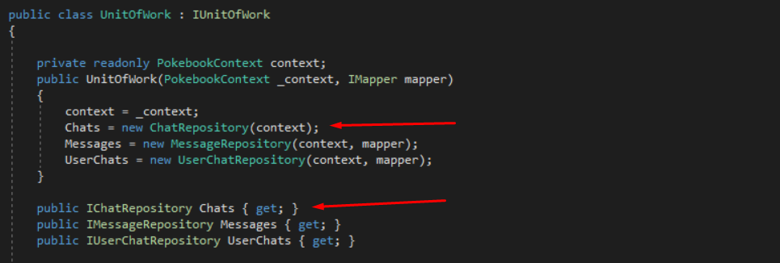

# EE Pokebook Team Rocket

ASP.NET app with API / Library. Users can chat, post and talk about events in Pokémon.

## Getting started

Clone [this](https://github.com/HBO5Informatica/1819-b03-3-ee-pokebook-team-rocket.git) repo to your local drive:

```bash
#!/bin/bash
$ git clone https://github.com/HBO5Informatica/1819-b03-3-ee-pokebook-team-rocket.git
```

## Using the repository pattern

The current repository system uses a generic repository **(1)**, in sync with a unit of work **(2)**.

- Implements `IRepository<T>`
  - no IQueryables are returned
  - no Update functionality is provided
  - uses `DbContext` instead of specific context

- Implements `IUnitOfWork` + `IDisposable`
- accounts for the syncing/saving to database
- contains all repositories as properties
- should be used to access repositories

### Adding a new repository

To add a new repo to the system, please adhere to following steps:

- Create a new interface specific to the repo in the folder *Repositories/Specific*
  - inherit from specific `IRepository<T>`
  - add specific functionalities

- Create the concrete repository in the folder *Repositories/Specific*
  - implement the interface
  - inherit from `GenericRepository<T>` or `MappingRepository<T>` if needed

- Add the new repository interface to the IUnitOfWork interface as a readonly property
- Add the new concrete implementation to the IUnitOfWork interface as seen below

 

### Using the Unit of Work (UoW)

We're not using the repositories directly in Controllers, that's where the Unit of Work comes in.
The UoW stands n for accessing the repositories and their methods. Also makes sure all modifications are saved to the database (see  `Complete()`).

A private field is created in the `ControllerCrudBase`, which is instantiated in the constructor with a specific `DbContext` and an injected mapper.

To access a method from a repository:

- select the desired repository from the UoW properties
- select the desired method

  *Note: if the method you're calling makes any modification to the repo (changing property value, adding, deleting), use `Complete()` after finishing accessing the UoW*
- return the value.

## Built with

- [Visual Studio Community 2017](https://visualstudio.microsoft.com/thank-you-downloading-visual-studio/?ch=pre&sku=Community&rel=15#) - The development IDE used
- [Visual Studio Code](https://code.visualstudio.com/download) - README editing & styling
- [.NET Core 2.1](https://dotnet.microsoft.com/download/thank-you/dotnet-sdk-2.2.202-windows-x64-installer) - .NET platform
- [Bootstrap 4.1.3](https://getbootstrap.com/) - Some styling was done using Bootstrap

## Authors

- **Sven Bouree** - *Developer* - [SvenBourree](https://github.com/SvenBourree)
- **Jens Philibert** - *Developer* - [Jens Philibert](https://github.com/PhilibertJens)
- **Jonathan Boydens** - *Developer - Repository logic* - [Testosternus](https://github.com/Testosternus)

## Acknowledgments

- Google
- StackOverflow
- Moshfegh Hamedani
- Any articles used

## License

This project is licensed under MIT License. For more information, see [LICENSE.md](LICENSE.md)
